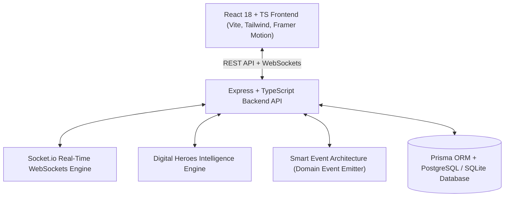

# 🏗️ DIGITAL HEROES — LEVEL 3 ULTIMATE MASTER ARCHITECTURE

## System Overview

Digital Heroes is an AI-native golf performance, subscription, rewards, and charitable-impact ecosystem built around personalization, transparency, trust, and measurable community impact.

---

## Modular Component Map

1. **User Platform**:
   - Adaptive Dashboard (`Dashboard.tsx`)
   - Personal Journey Engine (`JourneyTimeline.tsx`)
   - AI Golf Performance Coach (`GolfCoach.tsx`)
   - Live Charity Impact Map & Explorer (`ImpactMap.tsx`, `CharityExplorer.tsx`)
   - Verified Impact Ledger (`ImpactLedger.tsx`)
   - Dynamic Draw Engine & Simulator (`DrawEngine.tsx`)

2. **Intelligence Layer**:
   - Personal AI Copilot ("MY DIGITAL HEROES AI" - `PersonalCopilot.tsx`)
   - AI Golf Performance Coach (`golf.service.ts`)
   - AI Admin Copilot (`admin.service.ts`)
   - AI Privacy Memory Store (`preference.service.ts`)

3. **Core Business Engines**:
   - Score Intelligence & Anomaly Detection
   - Subscription Intelligence
   - Transparent Draw Pool & Winner Verification
   - Configurable Achievement Gamification (`gamification.service.ts`)
   - Smart Event Engine (`events.service.ts`)
   - Command Palette (`CommandPalette.tsx`)

4. **Security & Resilience Layer**:
   - Server-Side Role-Based Access Control (RBAC)
   - Idempotency Header Validation (`x-idempotency-key`)
   - Anomaly & Outlier Risk Monitor
   - Platform Trust & Verification Center
