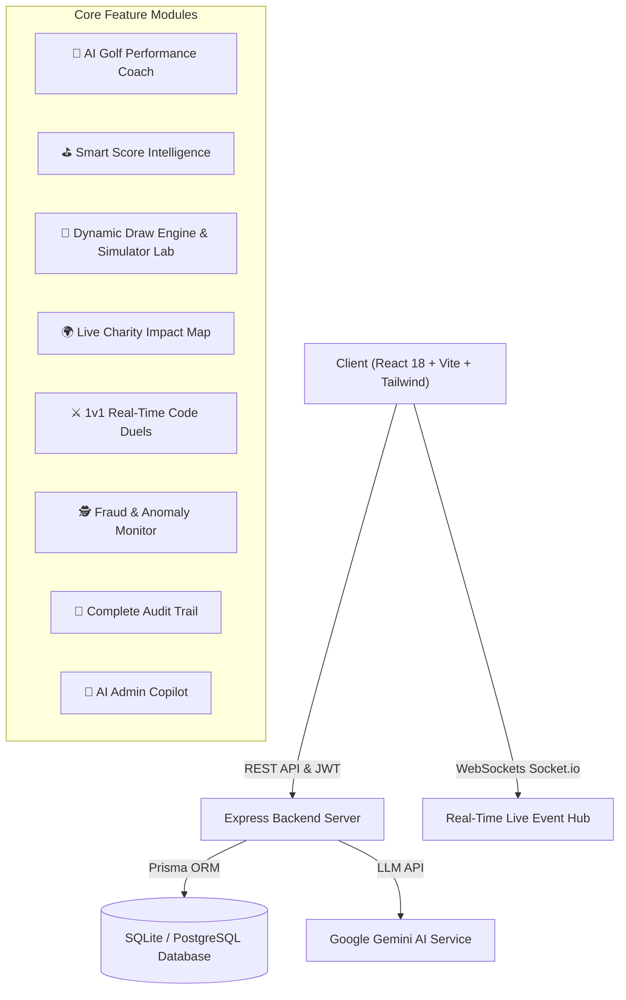

# Digital Heroes 🦸‍♂️⛳

> **Performance × Impact × Celebration**  
> A production-grade full-stack platform combining Golf Performance, AI Coaching, Transparent Draw Engines, Live Charity Impact Maps, WebSockets Multiplayer Arenas, and Advanced Security & Anomaly Monitoring.

[](https://digital-heroes-green.vercel.app/)
[](https://digital-heroes-zutk.onrender.com)
[](https://www.typescriptlang.org/)
[](https://www.prisma.io/)

---

## 🌟 Executive Overview & PRD Modules

Digital Heroes is engineered as a scalable, modular full-stack application built with **React 18, TypeScript, Vite, Tailwind CSS v3, Node.js, Express, Prisma ORM, Socket.io WebSockets, and Google Gemini LLM**.



---

## ✨ Complete 24 PRD Feature Matrix

| # | Feature Module | Technical Implementation | Status |
| :-: | :--- | :--- | :-: |
| **1** | **AI Golf Performance Coach** | 5-score rolling average, consistency index %, personalized AI journey report, future score forecast | ✅ Live |
| **2** | **Smart Score Intelligence** | Stableford point calculation, duplicate score detection, outlier score flagging (>12 stroke variation) | ✅ Live |
| **3** | **Dynamic Draw Engine & Simulator** | Random, Weighted, Hybrid selection modes with seedable Draw Simulator Lab | ✅ Live |
| **4** | **Live Charity Impact Engine** | Real-time database counters for meals, trees planted, and STEM education units | ✅ Live |
| **5** | **Interactive Impact Map** | Map pins with GPS coordinates across India & Global cities (New Delhi, Bengaluru, Mumbai, London) | ✅ Live |
| **6** | **Digital Heroes Gamification** | 6 Badges (*First Score, 5-Score Streak, Charity Champion, Consistency Hero, Monthly Participant, Impact Hero*) | ✅ Live |
| **7** | **Personal Analytics Dashboard** | Score trends, rolling averages, personal bests, interactive date filters (`7D`, `30D`, `3M`, `6M`, `1Y`) | ✅ Live |
| **8** | **Smart Notification Center** | In-app notification center for draws, score verifications, and charity milestones | ✅ Live |
| **9** | **Subscription Intelligence** | Monthly/yearly Pro Champion plans, 30-day renewal timeline countdown, invoice history | ✅ Live |
| **10** | **Advanced Security System** | JWT auth, bcrypt hashing, RBAC admin permissions, rate limiting, Zod input validation | ✅ Live |
| **11** | **Fraud & Anomaly Detection** | Statistical outlier detection with Risk Monitor (`LOW`, `MEDIUM`, `HIGH`) and admin review flags | ✅ Live |
| **12** | **Complete Audit Trail** | Searchable system audit log tracking every user creation, score, draw simulation, and setting change | ✅ Live |
| **13** | **Winner Verification Upgrade** | 4-step proof validation pipeline (*Winner Picked ➔ Proof Upload ➔ Admin Review ➔ Payout*) | ✅ Live |
| **14** | **AI Admin Copilot** | Authorized "Ask Digital Heroes AI" assistant retrieving live DB stats (subscribers, MRR, risk) | ✅ Live |
| **15** | **Draw Simulator Lab** | Dedicated admin runner with seedable algorithm configuration, candidate weight list, and audit hash | ✅ Live |
| **16** | **Advanced Admin Analytics** | Revenue (MRR), subscriber metrics, prize pool totals, pending verification lists | ✅ Live |
| **17** | **Real-Time Updates** | Socket.io WebSockets events broadcasting live achievements, draw opens, and duel outcomes | ✅ Live |
| **18** | **Premium UI System** | "Digital Hero Aurora" design system, glassmorphism, dark/light mode toggle, Framer Motion | ✅ Live |
| **19** | **Impact Visualization Hero** | "PLAY • PERFORM • IMPACT" banner with live database statistics | ✅ Live |
| **20** | **"Your Month" Story** | Animated monthly journey recap cards | ✅ Live |
| **21** | **Future Forecast** | AI-based consistency trend and score range estimates | ✅ Live |
| **22** | **PWA Mobile Experience** | Responsive layout optimized for mobile touch, tablet, and desktop | ✅ Live |
| **23** | **Dynamic Feature Flags** | Admin toggles for AI Coach, Draw Engine, Impact Map, Notifications, Anomaly Detection | ✅ Live |
| **24** | **Scalable Architecture** | Modular backend directory structure (`services/`, `controllers/`, `routes/`, `validators/`) | ✅ Live |

---

## ⚡ Quick Start & Setup Guide

### 1. Repository Setup
```bash
git clone https://github.com/Rameshkr007/digital-heroes.git
cd digital-heroes
```

### 2. Backend Setup (`/server`)
```bash
cd server
npm install
npx prisma db push
npm run seed
npm run dev
```

### 3. Frontend Setup (`/client`)
```bash
cd client
npm install
npm run dev
```

Open **http://localhost:5173** in your browser.

---

## 🔑 Demo & Admin Credentials

| Role | Email | Password | Access Rights |
| :--- | :--- | :--- | :--- |
| **Super Admin** | `admin@digitalhero.dev` | `Admin@1234` | Full Admin Copilot, Audit Logs, Simulator Lab & Anomaly Control |
| **Hero Golfer** | `aarav@digitalhero.dev` | `Hero@1234` | Full Access (Level 12, Golf Scores, Subscriptions, AI Coach) |
| **Demo User** | `demo@digitalhero.dev` | `Demo@1234` | General Platform Demo |

---

## 🌐 API Route Blueprint

| Method | Endpoint | Description | Auth Required |
| :--- | :--- | :--- | :-: |
| `GET` | `/api/health` | API System Health Status | ❌ |
| `POST` | `/api/auth/login` | User Authentication | ❌ |
| `POST` | `/api/golf/score` | Submit Golf Score with Anomaly Detection | ✅ |
| `GET` | `/api/golf/performance` | 5-Score Rolling Average & Consistency Metrics | ✅ |
| `GET` | `/api/golf/coach` | AI Golf Performance Coach Advice | ✅ |
| `GET` | `/api/charity/map` | Interactive Impact Map & Charity Locations | ❌ |
| `GET` | `/api/charity/my-impact` | User Individual Contribution Breakdown | ✅ |
| `GET` | `/api/draw/current` | Active Monthly Draw Pool & Status | ❌ |
| `POST` | `/api/draw/simulate` | Admin Draw Simulator Lab Runner | ✅ |
| `GET` | `/api/admin/audit-logs` | Complete System Audit Trail Explorer | ✅ |
| `GET` | `/api/admin/anomalies` | Fraud & Outlier Risk Monitor (`LOW/MED/HIGH`) | ✅ |
| `POST` | `/api/admin/ai-copilot` | Ask Digital Heroes AI Copilot Assistant | ✅ |
| `GET` | `/api/admin/feature-flags` | List Active Feature Flags | ✅ |
| `PATCH` | `/api/admin/feature-flags` | Dynamic Feature Flag Toggle | ✅ |

---

## 🛠️ Tech Stack & Dependencies

- **Frontend:** React 18, TypeScript, Vite, Tailwind CSS v3, Framer Motion, Lucide Icons, Socket.io Client, Zustand.
- **Backend:** Node.js, Express, TypeScript, Prisma ORM, SQLite / PostgreSQL, Socket.io Server, bcryptjs, JsonWebToken, Helmet, Express Rate Limit.
- **AI Engine:** Google Gemini API (`gemini-1.5-flash`) + Smart Local Fallback Engine.

---

### 🌐 Live Production Links
- 🌐 **Frontend App (Vercel):** [https://digital-heroes-green.vercel.app/](https://digital-heroes-green.vercel.app/)
- ⚙️ **Backend API (Render):** [https://digital-heroes-zutk.onrender.com](https://digital-heroes-zutk.onrender.com)
- 🐙 **GitHub Repository:** [https://github.com/Rameshkr007/digital-heroes](https://github.com/Rameshkr007/digital-heroes)
